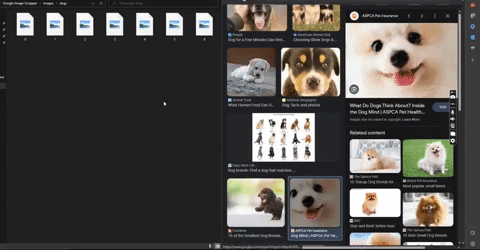

# Google-Images-Scraping-with-Python-Selenium
This Python script utilizes the Selenium library to automate web scraping of Google Images for a specific search phrase. It searches for images related to the given search phrase, scrolls to load more images, and downloads them to a specified directory.



## Prerequisites
- Python 3.x installed on your system.
- The Selenium library and its dependencies. You can install it using:

```
pip install selenium
```
- Keyboard library. You can install it using:
```
pip install keyboard
```

- Microsoft Edge WebDriver (msedgedriver.exe) compatible with your Edge browser version. Download it from the official Microsoft Edge WebDriver page.

### Usage
1. Clone this repository to your local machine using:
```
git clone git@github.com:PeWeX47/Google-Image-Scrapper.git
```

2. Navigate to the repository directory:
```
cd Google-Image-Scrapper
```

3. Ensure that the script file and your selenium driver file are in the same directory.

4. After changing the search phrase inside the script, run the script using the following command in command prompt:
```
python google-image-scrapper.py
```

5. Scrolling process can be stopped by pressing "S". 

### Disclaimer
This script is intended for educational purposes and personal use only. Be respectful of websites' terms of service, and do not use this script for any malicious or unauthorized activities.

